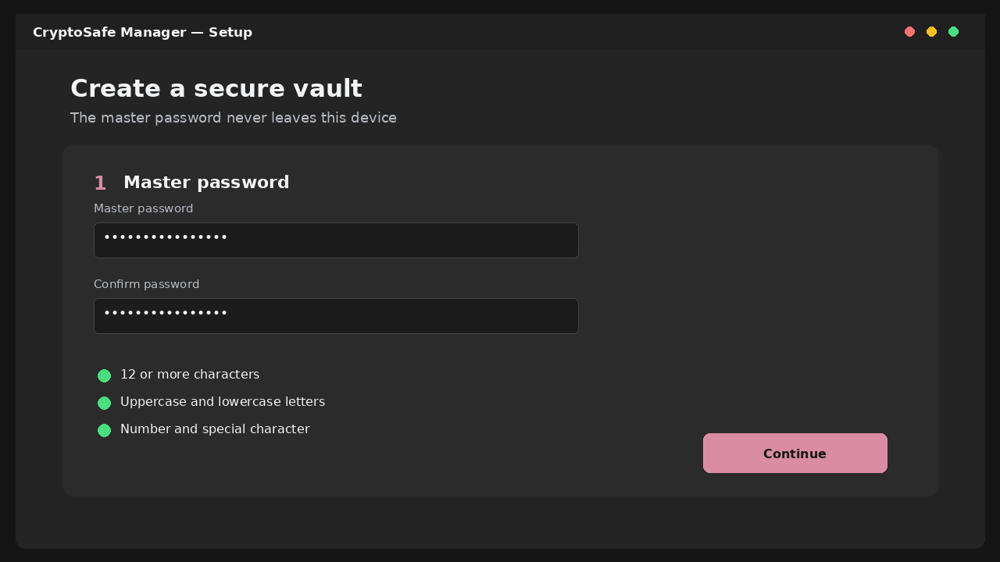
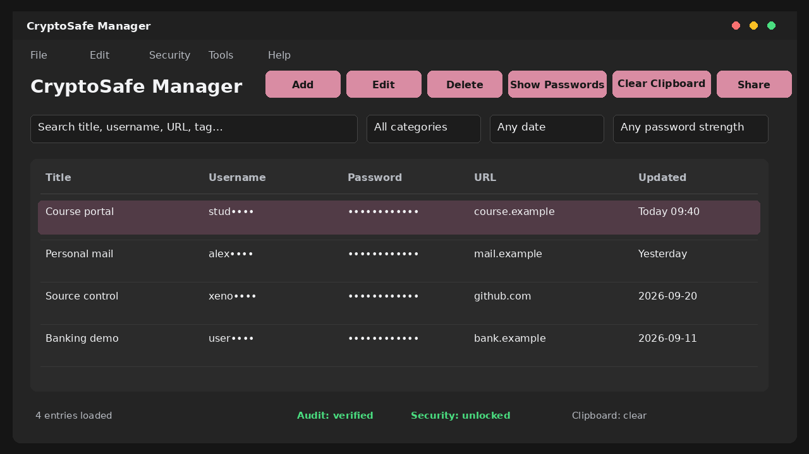
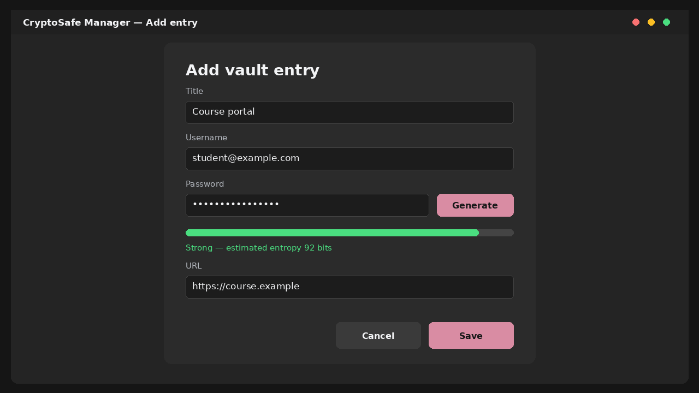
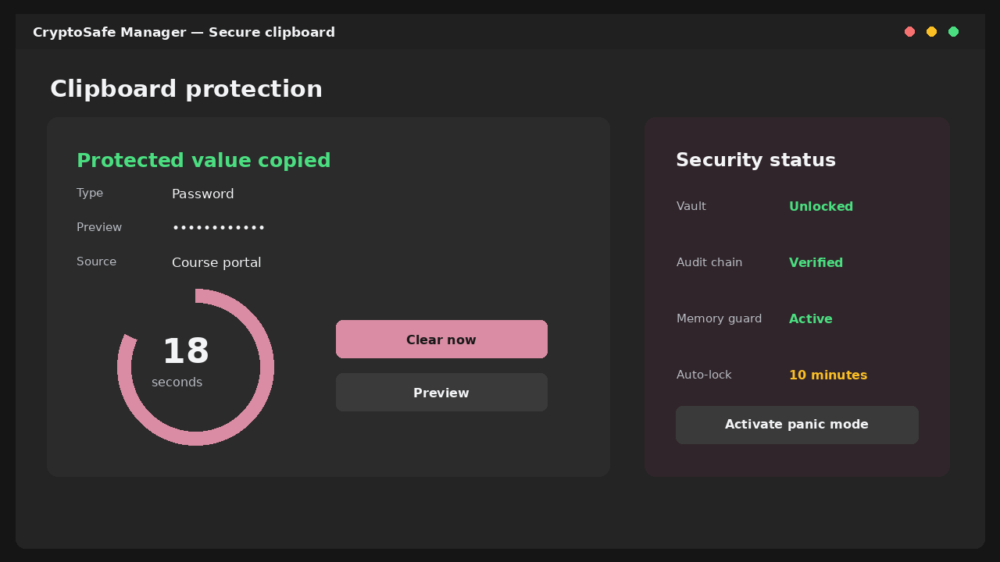
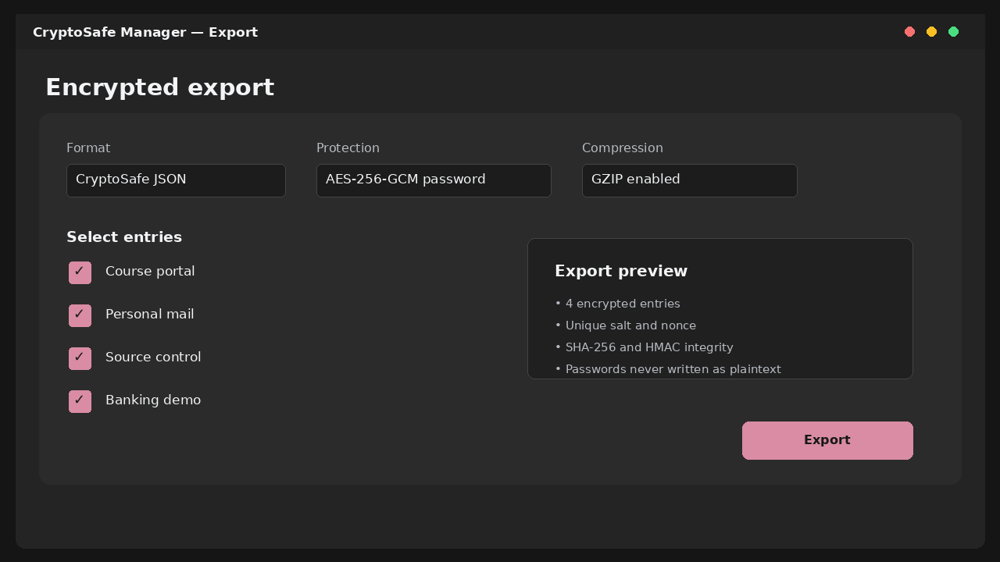
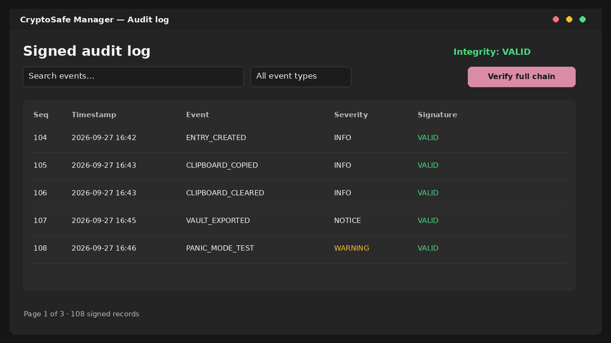

# CryptoSafe Manager

CryptoSafe Manager — локальный настольный менеджер паролей на Python. Приложение хранит записи в SQLite только в зашифрованном виде, поддерживает защищённый буфер обмена, импорт и экспорт, передачу отдельных записей, подписанный журнал аудита и аварийный режим блокировки.

Версия Sprint 8 объединяет функции Sprint 1–7 в итоговую поставку. В неё входят исходный запуск, воспроизводимые тесты, Linux-дистрибутив PyInstaller, пользовательская и техническая документация, демонстрационное видео и презентация.

## Возможности

- создание локального хранилища с мастер-паролем;
- добавление, редактирование, поиск и мягкое удаление записей;
- AES-256-GCM для записей и уникальный nonce для каждой операции;
- Argon2id для проверки мастер-пароля, PBKDF2-HMAC-SHA256 для ключа шифрования и HKDF для разделения ключей;
- генератор паролей и оценка стойкости;
- защищённый буфер обмена с таймером автоматической очистки;
- импорт и экспорт CryptoSafe JSON, CSV, Bitwarden JSON и LastPass CSV;
- защищённый обмен через пароль, RSA-OAEP, ECDH P-256 и QR-коды;
- Ed25519-подписи, SHA-256 хеш-цепочка и append-only журнал аудита;
- автоматическая блокировка, защищённая память, системный трей и panic mode;
- обработка ошибок в интерфейсе без вывода пользователю необработанного traceback.

## Быстрый запуск из исходного кода

Требуется Python 3.12.

### Windows

```powershell
git clone https://github.com/xenon54v/crysafe-manager.git
cd crysafe-manager
python -m venv .venv
.\.venv\Scripts\Activate.ps1
python -m pip install --upgrade pip
python -m pip install -r requirements.txt
python run.py --check
python run.py
```

### macOS и Linux

```bash
git clone https://github.com/xenon54v/crysafe-manager.git
cd crysafe-manager
python3 -m venv .venv
source .venv/bin/activate
python -m pip install --upgrade pip
python -m pip install -r requirements.txt
python run.py --check
python run.py
```

Команда `python run.py --check` проверяет обязательные зависимости, импорт точки входа и запись в локальную SQLite без открытия GUI.

По умолчанию исходный запуск использует `data/cryptosafe_dev.db`. Переменная `CRYPTOSAFE_DB_PATH` задаёт другой путь. Упакованная версия хранит данные в каталоге пользователя:

- Windows: `%LOCALAPPDATA%\CryptoSafe Manager`;
- macOS: `~/Library/Application Support/CryptoSafe Manager`;
- Linux: `$XDG_DATA_HOME/cryptosafe-manager` или `~/.local/share/cryptosafe-manager`.

## Запуск готового Linux-дистрибутива

Распакуйте `CryptoSafeManager-linux-x86_64.zip`, не меняя внутреннюю структуру папки, затем выполните:

```bash
chmod +x CryptoSafeManager/cryptosafe-manager
./CryptoSafeManager/cryptosafe-manager --check
./CryptoSafeManager/cryptosafe-manager
```

Дистрибутив собран в режиме PyInstaller `onedir`: исполняемый файл и все зависимости находятся в одной папке. Сборка предназначена для Linux x86_64. Для Windows и macOS используйте тот же spec-файл на целевой ОС.

## Тестирование

Обычный прогон:

```bash
python -m pytest -q
```

Полный прогон с порогом покрытия и HTML-отчётом:

```bash
./scripts/run_test_report.sh
```

Отчёт создаётся в [tests/report/index.html](tests/report/index.html). Покрытие измеряет криптографический, хранилищный, буферный, аудиторский, импортно-экспортный и БД-слои. Нативный GUI проверяется отдельно, так как автоматический прогон не использует дисплей-сервер. Итог Sprint 8: 203 теста, покрытие не ниже 80% и время полного прогона менее 30 секунд в контрольной среде.

Статические проверки:

```bash
python scripts/project_checks.py
ruff check --select E4,E7,E9,F src tests scripts run.py
python -m compileall -q src tests scripts run.py
```

## Основной сценарий работы

### Создание хранилища

При первом запуске мастер настройки предлагает создать мастер-пароль и выбрать файл БД. Пароль должен содержать не менее 12 символов, буквы обоих регистров, цифру и специальный символ.



### Работа с записями

Главное окно показывает записи с замаскированными именами и паролями. Кнопки `Add`, `Edit` и `Delete` управляют выбранной записью. Строка поиска поддерживает обычные и полевые запросы, например `title:"course portal"`.



Редактор проверяет обязательные поля, URL и JSON дополнительных данных. Генератор создаёт пароль по выбранной длине и наборам символов.



### Защищённый буфер обмена

Копирование запускает таймер. После его окончания приложение очищает системный буфер, защищённую копию в памяти и индикатор интерфейса. Доступны ручная очистка и предварительный просмотр с явным подтверждением раскрытия.



### Импорт и экспорт

Экспорт позволяет выбрать записи, поля, формат и способ защиты. Для резервной копии рекомендуется CryptoSafe JSON с AES-256-GCM и отдельным экспортным паролем. Импорт сначала показывает предварительный результат, проверяет целостность и только затем изменяет БД в транзакции.



### Аудит и аварийная блокировка

Журнал хранит последовательность подписанных событий. Команда полной проверки сверяет порядок, хеши, подписи и якорь последней записи. Panic mode очищает буфер и защищённую память, скрывает окно и блокирует хранилище. Восстановление требует мастер-пароль.



## Сборка PyInstaller

На Linux:

```bash
./scripts/build_linux.sh
```

Скрипт использует [packaging/cryptosafe-manager.spec](packaging/cryptosafe-manager.spec), создаёт `release/CryptoSafeManager/` и запускает встроенную проверку собранного файла. PyInstaller должен выполняться на каждой целевой ОС отдельно.

## Документация и материалы

- [Руководство пользователя](docs/user_guide.md)
- [Техническое описание](docs/technical.md)
- [HTML-отчёт о тестировании](tests/report/index.html)
- `docs/CryptoSafe_Manager_Demo.mp4` — демонстрация продолжительностью 3 минуты 12 секунд
- `docs/CryptoSafe_Manager_Final_Presentation.pptx` и PDF-версия — итоговая презентация на 6 слайдов
- `docs/CryptoSafe_Manager_Sprint_8_Code_Explanation.docx` — подробное русскоязычное объяснение кода

## Структура проекта

```text
run.py                         исходная и упакованная точка входа
src/core/                     бизнес-логика и безопасность
src/database/                 схема SQLite, пул и репозитории
src/gui/                      окна, диалоги, таблицы и трей
tests/sprint1 ... sprint8/    модульные и интеграционные тесты
tests/report/                 JUnit, coverage JSON и HTML-отчёт
scripts/                      проверки, сборка и генерация материалов
packaging/                    PyInstaller и политики ОС
docs/                         руководства, изображения, видео и презентация
```

## Известные ограничения

- Linux-дистрибутив собирается для x86_64 и не переносится напрямую на Windows или macOS.
- Для надёжного буфера обмена Linux нужны `wl-copy`/`wl-paste`, `xclip` или `xsel`; иначе используется резервный адаптер.
- Фоновый системный трей зависит от доступного нативного backend и графической сессии.
- Python не может гарантировать аппаратную защиту памяти, экранирование устройства или системную политику Secure Desktop. Приложение использует доступные механизмы ОС и безопасно снижает режим защиты при их отсутствии.
- Неподписанный экспорт CSV предназначен только для контролируемой миграции и требует явного подтверждения.
- Встроенной синхронизации и браузерного автозаполнения нет.

## Возможные следующие шаги

- расширение браузера с локальным подтверждением автозаполнения;
- TOTP и аппаратные ключи для второго фактора;
- зашифрованная синхронизация между доверенными устройствами;
- подписанные установщики Windows и notarized-приложение macOS;
- автоматический end-to-end прогон GUI на Windows, macOS, X11 и Wayland.

## Лицензия

Проект распространяется по лицензии MIT. См. [LICENSE](LICENSE).
