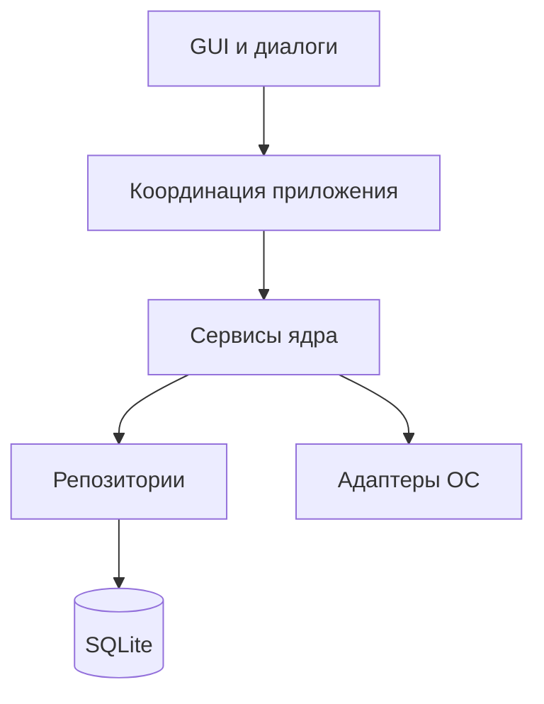

# Техническое описание CryptoSafe Manager

## 1. Назначение и границы

CryptoSafe Manager — локальное настольное приложение без серверной части. GUI управляет сервисами ядра, а ядро работает с SQLite через репозитории и транзакции. Секреты шифруются до записи на диск. Системный буфер, защищённая память и нативные средства ОС используются через отдельные адаптеры с безопасным снижением возможностей.

## 2. Архитектура

Слои имеют следующие обязанности:

| Слой | Основные модули | Ответственность |
|---|---|---|
| Интерфейс | `src/gui` | ввод, представление, подтверждения, безопасные сообщения об ошибках |
| Координация | `src/gui/main_window.py`, `src/main.py` | жизненный цикл сервисов, вход, блокировка, завершение |
| Ядро | `src/core` | криптография, записи, поиск, буфер, аудит, обмен и защита памяти |
| Данные | `src/database` | схема, миграции, пул соединений, транзакции и репозитории |
| Платформа | `platform_adapter.py`, `platform_security.py`, `os_keychain.py` | буфер, idle/screen lock, keyring и определение возможностей ОС |

Импорты направлены сверху вниз. Ядро не импортирует GUI. Проверка `scripts/project_checks.py` строит граф локальных импортов и завершает сборку при обнаружении цикла.

## 3. Криптографическая схема

### 3.1 Мастер-пароль и ключи

`KeyDerivationService` выполняет две независимые операции:

- Argon2id вычисляет хеш для проверки мастер-пароля. Параметры по умолчанию: `time_cost=3`, `memory_cost=65536 KiB`, `parallelism=4`, длина хеша 32 байта.
- PBKDF2-HMAC-SHA256 выводит 32-байтовый ключ шифрования с индивидуальной 16-байтовой солью и 200 000 итераций.

Приложение не использует хеш Argon2 как ключ AES. Проверка пароля и шифрование разделены. `KeyManager.derive_subkey()` применяет HKDF-SHA256 с контекстной строкой для ключей аудита и других назначений.

### 3.2 Записи хранилища

`AESGCMEncryptionService` сериализует чувствительные поля в JSON и шифрует AES-256-GCM. Каждая операция получает новый 96-битный nonce. Дополнительные аутентифицируемые данные связывают шифротекст с назначением. Ошибка тега преобразуется в контролируемую ошибку приложения.

Открытые столбцы `vault_entries` содержат только идентификатор, шифротекст, даты и теги для ограниченной индексации. Пароль, имя пользователя, URL и заметки находятся внутри `encrypted_data`.

### 3.3 Импорт, экспорт и обмен

Экспортный пароль защищает пакет отдельным PBKDF2-ключом и AES-GCM. Пакет включает SHA-256 и HMAC-SHA256 для проверки до изменения БД. Для адресного обмена используются RSA-OAEP либо эфемерный ECDH P-256 с выводом ключа. Операции имеют новые соль, nonce и ключевой материал.

QR-коды содержат только публичные ключи, зашифрованные пакеты или защищённые ссылки. Срок действия и nonce предотвращают повторное использование.

### 3.4 Журнал аудита

`AuditLogSigner` выводит отдельный ключ через HKDF и подписывает канонический JSON алгоритмом Ed25519. Запись содержит последовательный номер, хеш предыдущей записи, собственный SHA-256, подпись и идентификатор поколения ключа. Подписанный head-якорь обнаруживает удаление последних записей. SQLite-триггеры запрещают обновление и удаление подписанных событий, ключей, инцидентов и архивов обычными запросами.

## 4. Защита памяти и побочных каналов

`MemoryGuard` выделяет выровненную память, по возможности применяет `mlock` или `VirtualLock`, устанавливает защитные страницы и canary-значения. `ProtectedSecret` маскирует представление секрета и очищает память несколькими проходами. Python и ОС не дают абсолютной гарантии отсутствия копий в swap, crash dump или временных объектах, поэтому код не заявляет аппаратную защиту.

`SideChannelProtection` использует фиксированные SHA-256-дайджесты и `hmac.compare_digest`, выполняет полный проход поиска и при выбранном профиле добавляет алгоритмический шум и ограниченный jitter. Обычный профиль не добавляет задержку.

## 5. Защищённый буфер обмена

`ClipboardService` помещает секрет в `SecureBuffer`, копирует его платформенным адаптером и запускает монотонный таймер. Очистка проверяет токен содержимого, чтобы не удалить новое значение другого приложения. Монитор обнаруживает изменение буфера и переводит сервис в безопасное состояние. Очистка вызывается при таймере, ручной команде, блокировке, panic mode, выходе и закрытии.

Windows использует Win32 Clipboard API, macOS — `pbcopy`/`pbpaste`, Linux — Wayland или X11-утилиты. `PyperclipAdapter` и внутрипроцессный адаптер обеспечивают безопасное снижение возможностей, но не дают системной очистки при отсутствии нативного backend.

## 6. Ключевые структуры данных

`EntryManager` принимает словарь записи, нормализует категории и теги, проверяет обязательные поля, шифрует payload и выполняет запросы в транзакции. `VaultSearchIndex` хранит только сессионные расшифрованные данные и очищается при блокировке.

`EventBus` связывает сервисы без импорта GUI: операции публикуют типизированные dataclass-события, а мост аудита преобразует их в подписанные записи. `StateManager` хранит состояние входа, таймер и HMAC-тег целостности сессии.

## 7. Схема SQLite

Версия схемы: 7.

| Таблица | Назначение | Защита |
|---|---|---|
| `vault_entries` | активные записи | AES-GCM payload, уникальный id |
| `deleted_entries` | мягко удалённые записи | зашифрованный payload и срок очистки |
| `key_store` | соль, Argon2-хеш и параметры KDF | секретный ключ не хранится |
| `settings` | конфигурация | чувствительные значения шифруются |
| `audit_log` | подписанные события | хеш-цепочка, Ed25519, append-only триггеры |
| `audit_keys` | публичные ключи поколений | append-only триггеры |
| `audit_state` | head-якорь и статус проверки | подписанный якорь |
| `audit_incidents` | отдельные инциденты целостности | зашифрованные details и checksum |
| `audit_archives` | неизменяемые архивы | AES-GCM и checksum |
| `contacts`, `contact_keys` | доверенные публичные ключи | отпечаток, проверка и отзыв |
| `shared_entries` | история передачи | срок, права и checksum |
| `import_export_history` | метаданные обмена | формат, размер и статус проверки |
| `import_checkpoints` | возобновление частичного импорта | checksum источника и индекс |
| `exchange_nonces` | защита от replay | уникальный nonce и срок |

`Database` создаёт пул из четырёх соединений для файловой БД, включает foreign keys, WAL, busy timeout и управляет `BEGIN IMMEDIATE`, `COMMIT` и `ROLLBACK` в контекстном менеджере.

## 8. Обработка ошибок и граничных случаев

Сервисные исключения преобразуются в короткие сообщения в GUI. Точка входа записывает полный traceback только в локальный `cryptosafe.log`, а пользователю показывает тип ошибки и путь к журналу. Пустое хранилище, отсутствующая запись, неверный пароль, повреждённый пакет, неизвестный формат, исчерпанный таймер и недоступный нативный backend имеют проверяемые ветки.

Импорт ограничивает размер входа, время обработки и степень распаковки GZIP. Разбор выполняется изолированно. Замена хранилища использует транзакцию, а частичный режим сохраняет checkpoint.

## 9. Тестирование

Набор pytest проверяет:

- AES-GCM, Argon2id, PBKDF2, HKDF, Ed25519 и смену мастер-пароля;
- CRUD, поиск, soft delete, транзакции и конкурентные операции;
- таймеры буфера, платформенные адаптеры и очистку жизненного цикла;
- импорт, экспорт, дубликаты, rollback, RSA/ECC, QR и ограничения форматов;
- цепочку аудита, подмену и усечение, экспорт и нагрузку 10 000 событий;
- защищённую память, panic mode, авто-блокировку и профили безопасности;
- отсутствие циклических импортов, `TODO`/`FIXME`, исходный запуск и упакованную диагностику.

`scripts/run_test_report.sh` запускает pytest-cov с порогом 80% для `src/core` и `src/database`, сохраняет JUnit и coverage JSON и создаёт `tests/report/index.html`. Тесты нативного GUI не входят в числитель покрытия из-за отсутствия display server; форматирование данных и сервисы трея тестируются без реального окна.

## 10. Упаковка и запуск

`run.py` является общей точкой входа. Флаг `--check` импортирует обязательные зависимости и проверяет SQLite без создания окна. `packaging/cryptosafe-manager.spec` собирает onedir-дистрибутив и включает данные CustomTkinter, Tcl/Tk и динамические backend-модули keyring и pystray.

`src/main.py` лениво импортирует GUI, выбирает production-каталог для упакованного приложения, настраивает файловый журнал и перехватывает исключения на границе запуска.

## 11. Технические ограничения

- PyInstaller не выполняет кросс-компиляцию. Сборку нужно повторить на каждой ОС и архитектуре.
- Доступность системного трея, keyring, screen-lock API и защищённого буфера зависит от рабочего окружения.
- Обычный процесс Python не может включить Credential Guard, Secure Desktop, Gatekeeper, SELinux или AppArmor. Репозиторий содержит шаблоны и определение доступных возможностей, а развёртывание остаётся задачей ОС.
- Полное удаление БД вместе со всеми резервными копиями невозможно обнаружить из самой БД. Подписанный якорь обнаруживает усечение относительно сохранённого состояния, но не заменяет внешнюю резервную копию.

